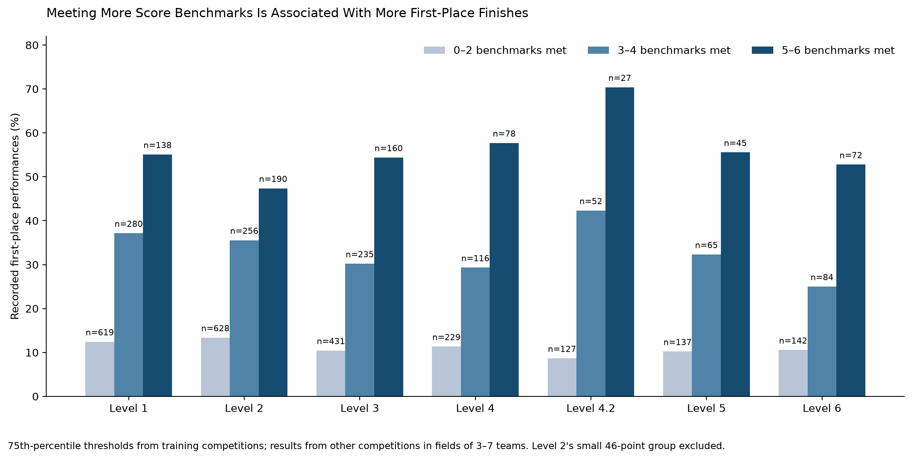
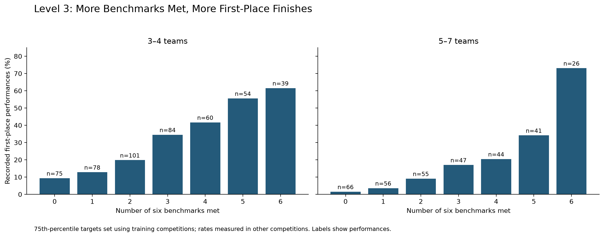
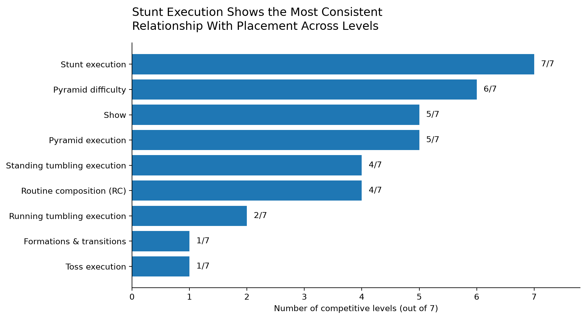
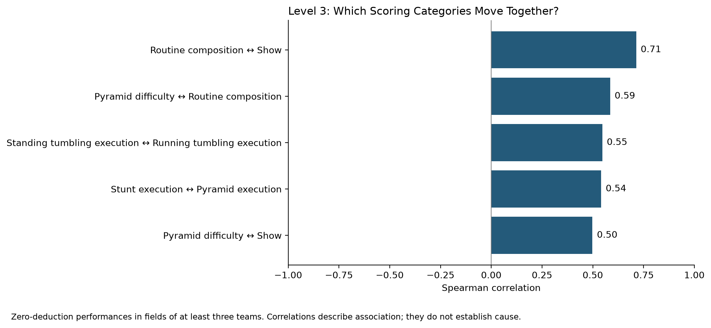
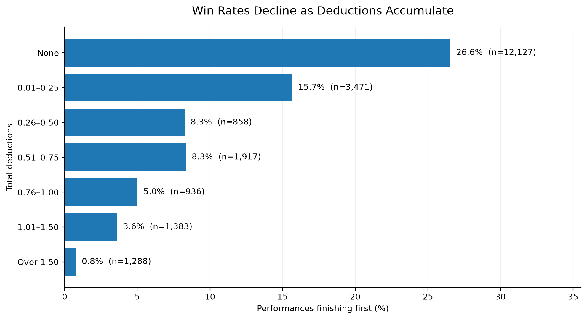
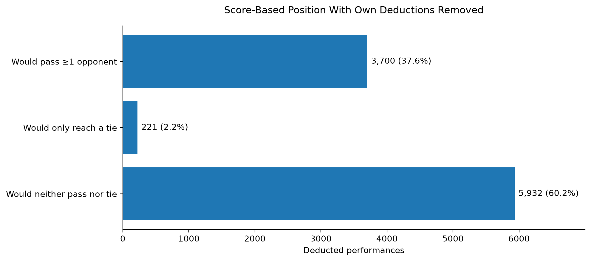
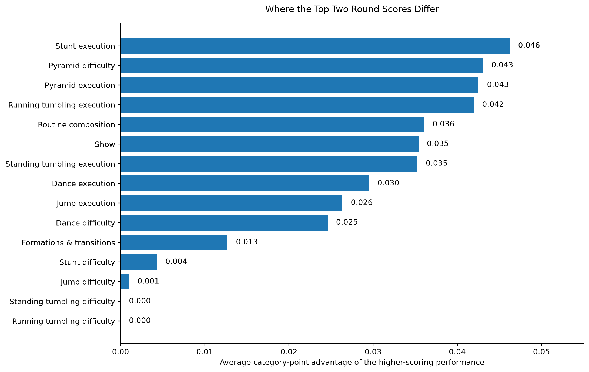
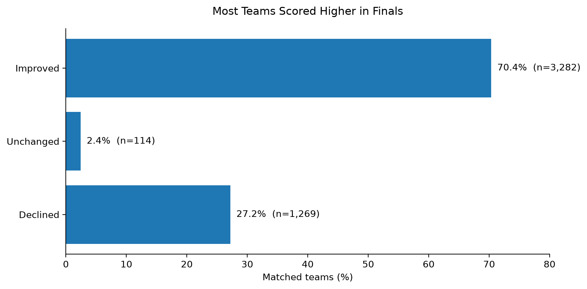
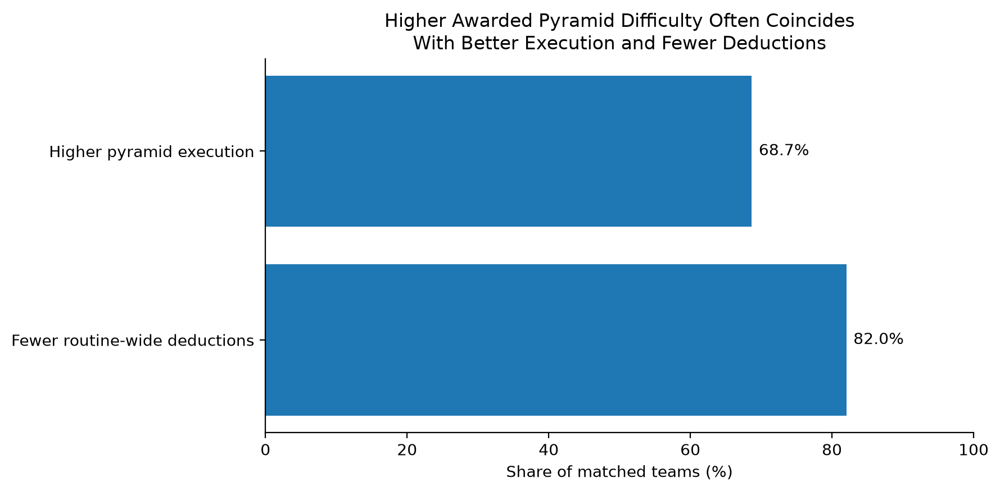

# All-Star Cheer Scoring Analysis

A coaching-focused analysis of 2025–26 competition scores: which scoring categories distinguish competitive performances, what strong score profiles look like, and how deductions and round-to-round changes relate to results.

## Why This Project Matters

Coaches make decisions about routine construction, practice priorities, execution, and risk throughout a season. Score sheets provide feedback on individual performances, but they do not automatically show which patterns repeat across teams and competitions.

This project uses published scoring data to examine those patterns.

The goal is to provide reference points coaches can use alongside their own knowledge of a team—not to prescribe a routine or promise that reaching a certain score will produce a win.

The analysis covers:

| Measure | Dataset scope |
|---|---:|
| Performances | 31,151 |
| Competitions | 160 |
| Team IDs | 4,408 |
| Division IDs | 294 |
| Levels | 1, 2, 3, 4, 4.2, 5, and 6 |

A **performance** is one team's scored appearance in a particular competition, division, and round. A team appearing in Prelims and Finals contributes two performances.

**Interactive Tableau dashboard:** planned. Benchmark datasets have been exported for dashboard development.

## Questions Examined

- Which scoring categories consistently distinguish competitive placements?
- How often do teams finish first when they meet more category benchmarks?
- How do those patterns differ by level and field size?
- Which scoring categories tend to move together?
- How are deductions associated with results?
- How much do the same team's scores change between rounds?
- Do changes in awarded pyramid difficulty coincide with changes in execution and deductions?

## Understanding the Data

The source data comes from publicly available Varsity TV competition results and PDF score breakdowns.

### Scorecard Formats

Two scorecard formats appear in the dataset:

| Format | Maximum raw score | Performances |
|---|---:|---:|
| Standard scorecard | 50 | 23,232 |
| No-toss scorecard | 46 | 7,919 |

A raw score of 45 does not mean the same thing on a 46-point sheet as it does on a 50-point sheet. Benchmark thresholds are therefore calculated separately by level and scorecard format.

### Round Scores and Placement

An **individual-round score** describes a single performance. An **event score** may combine rounds according to the competition's scoring rules.

Published placement and individual-round score order are not always interchangeable. A team can have a stronger individual round without necessarily finishing ahead in the overall event.

This project identifies which outcome each comparison uses.

A **competitive field** is the group of performances in the same competition, level, division, and round. Placement analyses generally include fields of at least three teams, leaving 21,980 eligible performances.

### Difficulty, Execution, and Deductions

Many difficulty categories have limited variation within a level. Meeting expected difficulty may be essential to competitiveness while offering little separation between teams that already receive similar difficulty scores.

Execution and presentation categories can provide additional separation, but their scoring ranges differ. Raw point differences alone should not be treated as a universal ranking of coaching priorities.

**Zero recorded deductions is not proof that every intended skill was completed.** A team may receive less awarded difficulty or execution without a recorded penalty.

## Findings

### 1. Meeting More Score Benchmarks Is Associated With More First-Place Finishes

Benchmarks were calculated at the 75th and 90th percentiles of eligible training performances, separately by level and scorecard format. First-place rates were then measured in other competitions.

A **75th-percentile target** is the score at the point where approximately three-quarters of the training scores fall at or below it. A 90th-percentile target is more selective.

These are percentiles of the training field, not percentiles of winners alone.

Because scores occur in discrete increments and teams can receive identical scores, meeting a 75th-percentile target does not necessarily put a performance in an exact top 25%.

#### Level 3 Benchmark Targets — 50-Point Scorecard

| Category | 75th-percentile target | 90th-percentile target |
|---|---:|---:|
| Stunt execution | 3.90 | 3.90 |
| Pyramid execution | 3.90 | 3.90 |
| Standing tumbling execution | 3.90 | 4.00 |
| Running tumbling execution | 3.90 | 4.00 |
| Show | 1.83 | 1.87 |
| Routine composition | 1.83 | 1.90 |

A performance meets a benchmark when its category score is **at or above** the target. Each of the six categories contributes one to the benchmark count; categories are not weighted by their point value or model coefficient.

The 75th and 90th percentile targets can be identical where the score distribution is concentrated at the same value.

#### Pattern Across Levels

Within fields of three to seven teams, recorded first-place rates increased across the groups meeting 0–2, 3–4, and 5–6 benchmarks for every main level/scorecard group shown.

**What this means for coaches:** The useful pattern is strength across several execution and presentation categories. An excellent score in one category does not necessarily describe the overall strength of a performance.

Coaches can compare their team's scores with the targets for the appropriate level and scorecard format, then investigate where the team consistently falls short.

The analysis does not establish which practice change would improve those scores or whether every category deserves equal practice time.

#### Level 3 Detail

For Level 3's 75th-percentile targets:

| Exact number of benchmarks met | First-place rate: 3–4 team fields | First-place rate: 5–7 team fields |
|---:|---:|---:|
| 0 | 9.3% (75 performances) | 1.5% (66) |
| 1 | 12.8% (78) | 3.6% (56) |
| 2 | 19.8% (101) | 9.1% (55) |
| 3 | 34.5% (84) | 17.0% (47) |
| 4 | 41.7% (60) | 20.5% (44) |
| 5 | 55.6% (54) | 34.1% (41) |
| 6 | 61.5% (39) | 73.1% (26) |

Each row contains performances meeting **exactly** that many targets. The groups do not overlap.

The progression persisted after excluding the event contributing the most Level 3 performances in large fields.

**Why field size matters:** Finishing first among three teams is a different competitive outcome from finishing first among ten. Compare benchmark results within a relevant field size rather than treating the overall rate as a personal probability of winning.

The 73.1% result in five-to-seven-team fields does not demonstrate that those fields are easier than three-to-four-team fields. The groups contain different teams, competitions, and score profiles.

#### Coverage and Caution

One competition supplied 284 of 372 Level 3 evaluation performances in fields of eight or more teams. Its contribution was even greater in several high-benchmark groups.

Those large-field rates are therefore heavily influenced by one event.

The 90th-percentile targets identify more selective groups, but some contain very few performances or competitions. Large percentages from small groups require particular caution.

**Coaching takeaway:** Use these targets as score-sheet reference points. They are not minimum scores required to win, guaranteed outcomes, or estimates of what will happen after changing a routine.

### 2. Stunt Execution Shows Consistent Relationships With Placement Across Levels

Stunt execution appeared among the five most negative average conditional placement coefficients at all seven levels. Pyramid difficulty appeared at six levels.

A **conditional relationship** describes the association between a category and placement after accounting for the other categories included in the model.

For these models, a more negative coefficient indicates an association with better normalized placement.

The chart counts how often a category appeared among the five strongest such relationships. It does not measure the number of placements gained from a score increase.

**What this means for coaches:** Stunt execution repeatedly distinguished stronger competitive performances across levels. It deserves attention when reviewing why otherwise competitive routines receive different scores.

That does not mean stunt execution should always receive the most practice time. A team's existing weaknesses, routine content, and opportunities for improvement still matter.

Correlated categories also share information. Their model coefficients should not be read as isolated judgments of each category's importance.

### 3. Related Categories Often Move Together

Among eligible Level 3 zero-deduction performances, the strongest category-pair Spearman correlations were:

| Category pair | Spearman correlation |
|---|---:|
| Routine composition ↔ Show | 0.71 |
| Pyramid difficulty ↔ Routine composition | 0.59 |
| Standing tumbling execution ↔ Running tumbling execution | 0.55 |
| Stunt execution ↔ Pyramid execution | 0.54 |
| Pyramid difficulty ↔ Show | 0.50 |

**Spearman correlation** measures how consistently higher scores in one category accompany higher scores in another. It ranges from −1 to +1:

- Positive values mean the categories tend to rise together.
- Values near zero indicate little consistent monotonic relationship.
- Negative values mean higher scores in one tend to accompany lower scores in the other.

A correlation of 0.71 does not mean a 71% improvement or a 71% chance of receiving a particular score.

**What this means for coaches:** Some score-sheet categories describe related aspects of a strong performance. For example, routine composition and show scores often move together.

This can help coaches recognize broader score profiles instead of interpreting each category as an entirely separate issue.

However, these correlations do not prove that improving routine composition causes show scores to improve. They may reflect shared performance quality, scorecard criteria, competition context, or other factors.

They also do not establish that judges intentionally link the categories.

### 4. Larger Deductions Are Associated With Fewer First-Place Finishes

Among performances in fields of at least three teams:

- 26.6% of deduction-free performances had recorded rank 1.
- 15.7% with 0.01–0.25 deductions had recorded rank 1.
- Approximately 8.3% with 0.26–0.75 deductions had recorded rank 1.
- 0.8% with more than 1.50 deductions had recorded rank 1.

A **recorded first-place rate** is the percentage of performances in a group with published rank 1. Published results can contain ties, so it does not always represent a unique winner.

**What this means for coaches:** Even relatively small deductions are associated with fewer first-place finishes. Larger deduction totals generally accompany weaker competitive outcomes.

There is no demonstrated universal deduction cutoff beyond which a team cannot win.

Teams can still finish first with deductions: of 882 recorded first-place performances with deductions, 586 competed against at least one deduction-free opponent.

These comparisons involve different performances. They do not show what the same team would have scored or placed with a clean routine.

#### The Point Value of a Deduction May Not Describe the Full Cost of a Mistake

A performance error can potentially affect:

- Awarded difficulty
- Execution
- Recorded deductions

This analysis distinguishes the penalty recorded on the sheet from other score changes that may accompany the performance.

Scorecards alone do not identify the complete cause or cost of a particular mistake.

#### Deduction-Only Score Comparison

Among 9,853 performances with deductions, removing only a team's own deductions while holding opponents' recorded scores constant would allow:

- 37.6% to pass at least one opponent.
- Another 2.2% to reach a tie without passing an opponent.

**What this comparison does:** It asks whether restoring the recorded penalty points alone would cross another team's individual-round score.

**What it does not do:** It does not restore difficulty or execution points, simulate a clean routine, or recalculate official cumulative event placements.

For coaches, it illustrates how penalties can matter in close score comparisons without claiming to reconstruct what would have happened.

### 5. Small Category Differences Separate the Top Round Scores

Across 3,988 fields with distinct top-two individual-round scores, the median score margin was 0.717 points.

The **median** is the middle observed margin: half the margins were at or below it and half were at or above it.

The largest average raw category-point gaps included stunt execution, pyramid difficulty, pyramid execution, and running tumbling execution. Standing and running tumbling difficulty showed virtually no average gap.

**What this means for coaches:** When difficulty scores are similar, differences in execution and other score-sheet details can help separate the strongest round scores.

Limited variation in a difficulty category does not mean that difficulty is unimportant. It may mean that the top performances already receive similar credit in that category.

These comparisons use the two highest individual-round scores, not necessarily the published first- and second-place teams.

Raw category-point gaps are descriptive differences. They are not normalized importance measures, estimates of return on practice time, or evidence that changing a category would reverse the result.

### 6. Most Matched Teams Scored Higher in Finals

Among 4,665 matched team–competition–division pairs with one Prelims and one Finals performance:

| Measure | Observed result |
|---|---:|
| Share scoring higher in Finals | 70.4% |
| Average individual-round score change | +0.621 points |
| Average pre-deduction score change | +0.549 points |
| Average deduction change | −0.071 points |

A **matched comparison** follows the same team within the same event and division, rather than comparing unrelated teams.

Only 34.6% of matched pairs had fewer deductions in Finals. Teams with unchanged deductions still had a median round-score increase of 0.507 points.

**What this means for coaches:** A higher Finals score is not necessarily explained by fewer penalties. Changes in awarded category scores also contribute.

The observed average provides context for discussing round-to-round movement, but it should not be treated as an expected increase for every team.

The data cannot establish whether routine changes, performance improvements, judging differences, or other factors caused the score changes.

### 7. Awarded Pyramid Difficulty Can Change Alongside Execution and Deductions

Among 217 Level 3 matched team–competition–division pairs whose awarded pyramid difficulty changed between two rounds:

- The higher-difficulty round also had higher pyramid execution in 68.7% of cases.
- It had fewer routine-wide deductions in 82.0% of cases.
- The pairs came from 51 competitions.

After excluding the three most represented competitions, the pattern persisted among 160 pairs across 48 competitions:

- 65.6% had higher pyramid execution in the higher-difficulty round.
- 80.6% had fewer deductions.

This exclusion is a **sensitivity check**: it tests whether the result depends heavily on the largest contributors to the sample.

**What this means for coaches:** Awarded difficulty and execution may move together when the same team's performance changes. This is consistent with the possibility that a disrupted or incomplete sequence affects more than one part of the score sheet.

However, **awarded difficulty describes the recorded performance, not necessarily the routine the team intended to perform**.

The deductions analyzed here are routine-wide. They cannot be attributed specifically to the pyramid.

The data does not identify omitted sequences, intentional routine adjustments, the reason a score changed, or the cause of a penalty.

## Modeling and Validation

The technical analysis includes:

- Score-distribution and observed-ceiling checks by level.
- Zero-deduction comparisons.
- Spearman correlations and category-gap comparisons.
- Within-field standardized predictors.
- Ridge regression.
- Nested competition-held-out validation.
- Coefficient stability checks.
- Deduction and field-size interaction models.
- Training-derived percentile benchmarks.
- Competition-coverage and sensitivity checks.
- Same-team comparisons across rounds.

### Within-Field Standardization

Standardization expresses a category score relative to the other scores in its competitive field.

This helps account for differences in scoring ranges and competitive context. A category with a larger raw scoring range should not automatically appear more informative solely because its numbers vary more.

### Ridge Regression

Ridge regression estimates relationships between several scoring categories and placement at the same time.

Its regularization reduces instability when categories are correlated. This matters because strong teams often score well across multiple related categories.

The coefficients describe conditional associations within the modeled data. They are not causal estimates or recommended practice allocations.

### Competition-Held-Out Evaluation

Competitions are separated between training and evaluation so that the same event does not appear on both sides of a split.

This checks how well the patterns carry to other competitions rather than measuring only how well a model fits the data it learned from.

Nested cross-validation also separates model tuning from outer evaluation.

### Interpreting Model Performance

Category-based models achieved mean held-out R² of approximately 0.57–0.64 for Levels 1–4. Performance was lower and more variable at higher levels, particularly Level 6.

**R²** measures how much variation in the modeled outcome is explained relative to a mean-prediction baseline. An R² of 0.60 does not mean the model correctly predicts 60% of winners.

Because placement is derived from scoring, these models evaluate how recorded category scores distinguish competitive outcomes within the scoring system.

Predictive accuracy alone does not establish which coaching intervention would improve results.

Earlier benchmark exploration examined the full dataset. Subsequent competition-split checks provide evidence of robustness, but should not be presented as fully independent prospective validation.

## Limitations

- Competition formats vary, and published rank may include ties or cumulative scoring.
- Performances are repeated observations of teams and competitions.
- Scorecard formats and category applicability differ.
- Some difficulty categories have little variation within a level.
- Zero deductions do not guarantee completion of every intended skill.
- Scores do not capture routine intent, video evidence, judge reasoning, or the cause of each penalty.
- Small and event-concentrated groups limit generalization.
- Field size and field composition affect first-place rates.
- Category correlations may reflect shared performance quality and competition context.
- Observed associations do not establish the effects of changing a routine.
- Regional scoring differences and individual judge behavior are not established by this project.

## Using the Findings as a Coach

1. Select the correct level and scorecard format.
2. Compare category scores with the relevant benchmark targets.
3. Look for recurring gaps across performances rather than reacting to one score sheet.
4. Interpret competitive outcomes alongside field size and deductions.
5. Use the findings to guide review of routines and performance footage.
6. Apply coaching judgment when deciding what to change.

The analysis provides context for those decisions. It does not replace score-sheet rules, video review, or knowledge of the athletes.

## Repository Workflow

| Notebook | Purpose |
|---|---|
| `notebooks/01_scoring_eda.ipynb` | Exploration, modeling, validation, and analytical exports |
| `notebooks/02_findings_visuals.ipynb` | Findings narrative and static figure exports |

The main analytical input is:

`data/processed/season_2026_all_levels_performances.csv`

Run `01` before `02` to generate the derived inputs used by the findings notebook.

### Dashboard and Analytical Exports

| File | Contents |
|---|---|
| `tableau_benchmark_performances.csv` | 6,643 evaluation performances with level-specific 75th/90th-percentile benchmark counts |
| `tableau_benchmark_thresholds.csv` | Category targets by level, scorecard format, and percentile |
| `category_pair_correlations.csv` | Category-pair correlations by level |
| `prelims_finals_changes.csv` | Matched Prelims-to-Finals score changes |
| `pyramid_round_changes.csv` | Matched Level 3 changes in awarded pyramid difficulty |

Exports are saved under `data/processed/`. Static figures are saved under `reports/figures/`.

## Tools

Python, pandas, NumPy, scikit-learn, statsmodels, and Matplotlib.

Tableau will provide interactive exploration of the benchmark and analytical exports.

## Author

Alec Heffron — cheerleading program director and coach transitioning into data analytics.